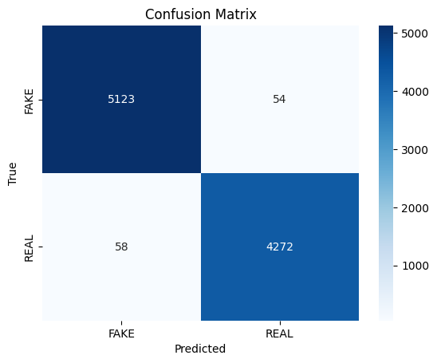
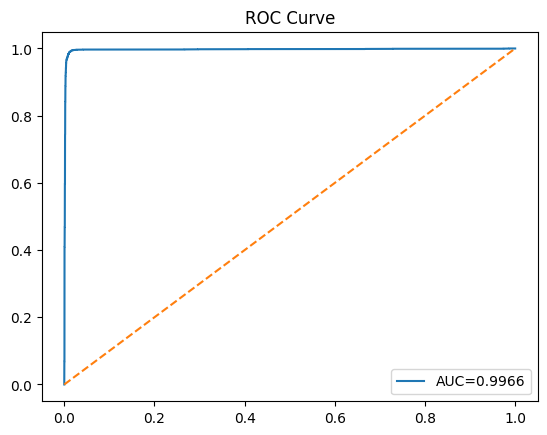
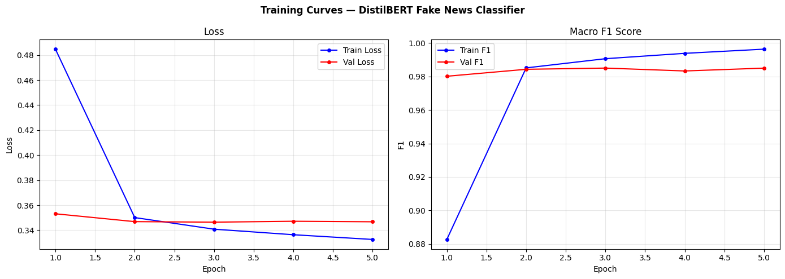

#  Fake News Detector — DistilBERT
**Binary classification: REAL vs FAKE news headlines/articles**

---

##  Project Structure

```
fake_news_distilbert/
├── 1_dataset.py   → Download & explore datasets
├── 2_preprocessing.py      → Clean, tokenize, split data
├── 3_modelArchitecture.py              → DistilBERT + classifier architecture
├── 4_training.py              → Training loop (anti-overfitting)
├── 5_evaluation.py           → Metrics, ROC, confusion matrix
├── 6_prediction.py            → Inference on real headlines
├── requirements.txt
└── README.md
```

> **Rename before running:**
> - `3_model.py` → `model_arch.py`
> - `2_preprocessing.py` → `preprocessing.py`

---

## Recommended Datasets

| Dataset | Size | Source | Best For |
|---|---|---|---|
| **WELFake** ✅ | 72,134 articles | Kaggle | Best overall benchmark |[USED THIS DATASET FOR TRAINING]
| **ISOT** | 44,898 articles | UVic | Reuters real + scraped fake |
| **HuggingFace (ErfanMoosaviMonazzah)** | 44,267 articles | HuggingFace Hub | Easiest to load (no login) |
| **LIAR** | 12,836 statements | Penn State NLP | Political claims, harder |
| **FakeNewsNet** | ~23,000 articles | GitHub/KaiDMML | Richest metadata |

---

##  Quickstart 

```bash
# 1. Install dependencies
pip install -r requirements.txt

# 2. Rename scripts
cp 3_model.py model_arch.py
cp 2_preprocessing.py preprocessing.py

# 3. Run pipeline in order
python 1_dataset_download.py   # Downloads HuggingFace dataset
python preprocessing.py        # Cleans & splits data
python model_arch.py           # Verifies model builds
python 4_train.py              # Trains the model (~40 min on GPU)
python 5_evaluate.py           # Full evaluation report
python 6_predict.py            # Predict your own headlines
```

---

## Model Architecture

```
Input text → DistilBertTokenizer (MAX_LEN=256)
           → DistilBERT backbone (6 transformer layers, 768-dim)
           → [CLS] token (768-dim)
           → LayerNorm
           → Dropout(0.3)
           → Linear(768 → 256) + GELU
           → Dropout(0.3)
           → Linear(256 → 2)
           → Softmax → {FAKE, REAL}
```

**Parameters:** ~67M total | ~65M trainable (freeze bottom 2 layers)

---

## 🛡️ Anti-Overfitting / Best-Fit Techniques

| Technique | Where | Purpose |
|---|---|---|
| Dropout (0.3) | Model head (×2) | Regularization |
| Label smoothing (0.1) | Loss function | Prevents overconfidence |
| Weight decay (0.01) | AdamW optimizer | L2 regularization |
| Layer-wise LR Decay | Optimizer | Prevents catastrophic forgetting |
| Cosine warmup scheduler | Training | Stable convergence |
| Early stopping (patience=3) | Training loop | Stops before overfitting |
| Gradient clipping (1.0) | Training loop | Prevents gradient explosion |
| Mixed precision (FP16) | Training loop | Speed + stability |
| Stochastic Weight Averaging | Epochs 7-10 | Better generalization |
| WeightedRandomSampler | DataLoader | Handles class imbalance |
| Freeze bottom 2 layers | Model init | Preserve pre-trained features |

---

##  Expected Performance (WELFake dataset)

| Metric | Expected Score |
|---|---|
| Accuracy | 96–98% |
| Macro F1 | 0.96–0.98 |
| ROC-AUC | 0.98–0.99 |
| Brier Score | < 0.05 |



---

##   Graphs after Training



##  Inference Example

```python
from predict import FakeNewsPredictor

predictor = FakeNewsPredictor()

result = predictor.predict("Scientists discover cure for Alzheimer's disease")
# → {'label': 'REAL', 'verdict': 'REAL', 'confidence': 0.94, ...}

results = predictor.predict_batch([
    "Government admits to hiding UFO technology for decades",
    "Federal Reserve raises interest rates by 25 basis points",
])
```

---

##  Key Hyperparameters

```python
MAX_LEN       = 256      # Tokens per input (256 for headlines, 512 for full articles)
BATCH_SIZE    = 32
LEARNING_RATE = 2e-5
WEIGHT_DECAY  = 0.01
DROPOUT_RATE  = 0.3
EPOCHS        = 10
WARMUP_RATIO  = 0.06
PATIENCE      = 3        # Early stopping
FREEZE_LAYERS = 2        # Bottom DistilBERT layers to freeze
```

---

##  Fit Diagnosis Guide

The training curves script (`5_evaluate.py`) auto-diagnoses your model:

- **Overfitting:** Train F1 >> Val F1 by >10% → increase dropout, freeze more layers
- **Underfitting:** Both train/val F1 < 80% → more epochs, unfreeze layers, use full article text
- **Good fit:** Small gap (<3%), val F1 > 90% → model is production-ready
